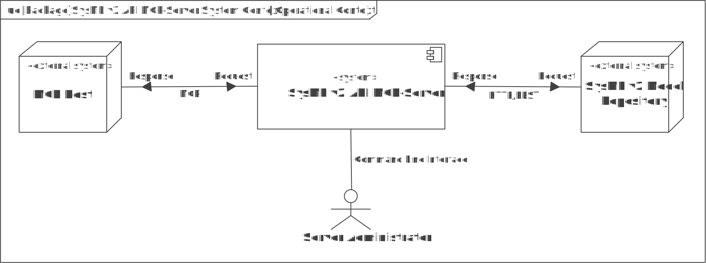

# SysML v2 API MCP-Server

> [!WARNING]
> This project is currently **WORK IN PROGRESS**, has not yet been officially released, and is by no means suitable for productive use!

## About This Project

The Model Context Protocol (MCP) is basically an open protocol for communication between AI models (e.g., ChatGPT, Google Gemini or Claude) and external systems. MCP was officially unveiled by Antropic PBC on November 25, 2024, and released as an open-source project (see https://modelcontextprotocol.io/).

The goal of this project is to develop a MCP server written in C++ that provides AI models and agents with a SysML v2 model as context. For this purpose, the server can access a REST endpoint via HTTP/HTTPS that offers resources and methods defined by the [SysML v2 Application Programming Interface (API) & Services](https://www.omg.org/spec/SystemsModelingAPI) specification (You can find the pilot implementation here: https://github.com/Systems-Modeling/SysML-v2-API-Services).

## Architecture and Design

### System Context

The analysis of the system context serves to answer the question: How will the so-called system of interest—in this case our SysML v2 API MCP Server—be embedded in its operational environment? In other words, a system context view is a view that depicts and describes the external systems and users with which our MCP Server directly communicates or interacts. Thus, the context also defines the system boundary.

The following diagram uses UML (Unified Modeling Language) notation to depict the system context.

### Internal Structure (Building Blocks)

The following UML class diagram depicts the components (building blocks) that made up the SysML v2 API MCP server. These are all C++ classes and interfaces (abstract classes without implementations).

One of the main architecture goals is high modularity. The implementation has a modular structure and can be easily expanded with additional MCP transport layers (e.g., gRPC) or other/additional HTTP tool clients. In particular, the SysML v2-specific part of the implementation (see folder src/sysmlv2) is small, clearly delineated, and loosely coupled with the rest of the server implementation. This ensures that the other code can be easily reused, e.g., to create another MCP server for a different purpose.

### Dependencies

The following UML package diagram depicts the project's dependencies on third-party projects and libraries.

## Usage

## License

MIT license (© 2025 Stephan Roth)